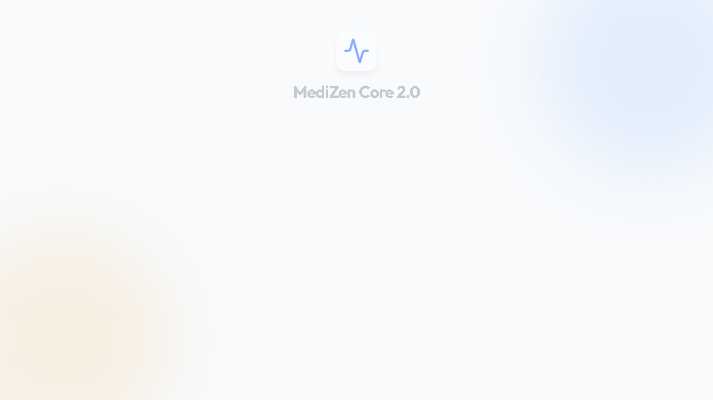
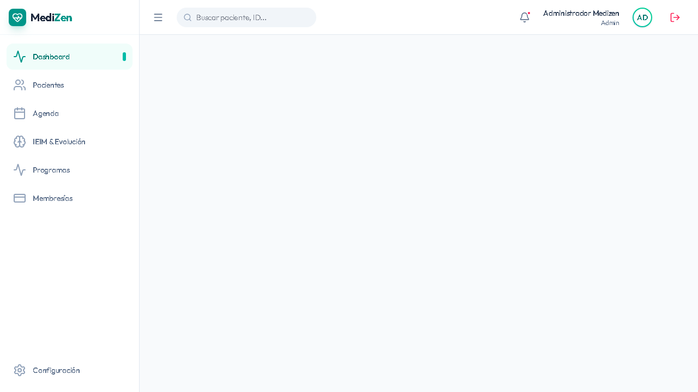
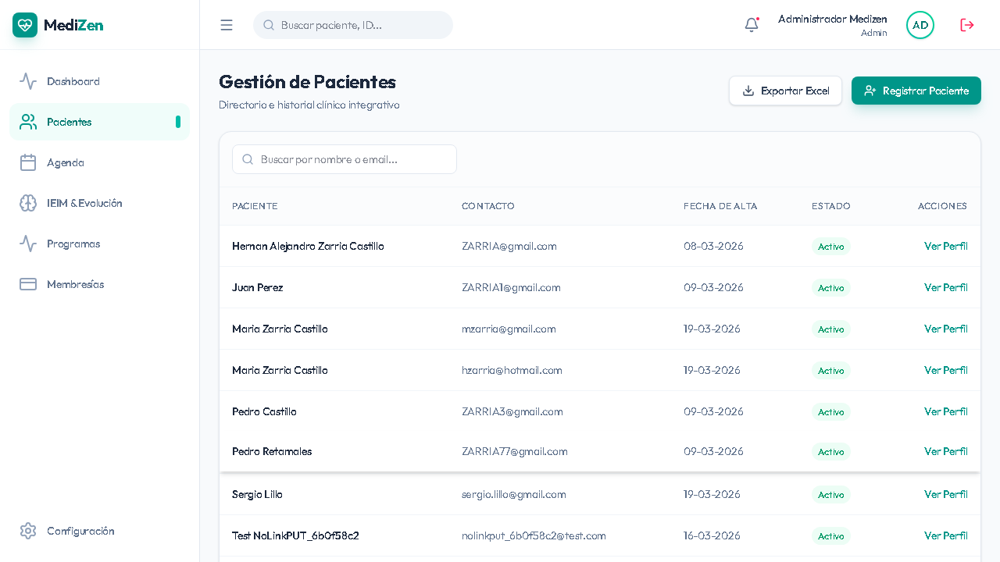
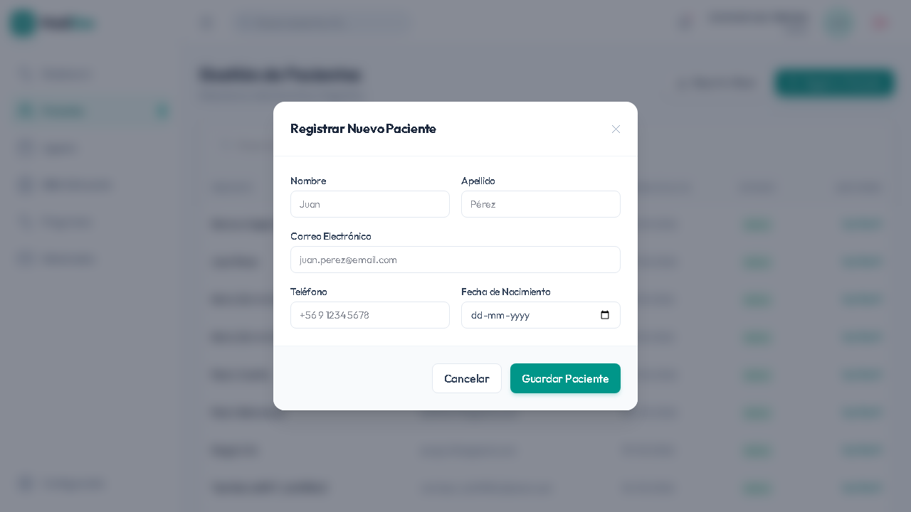
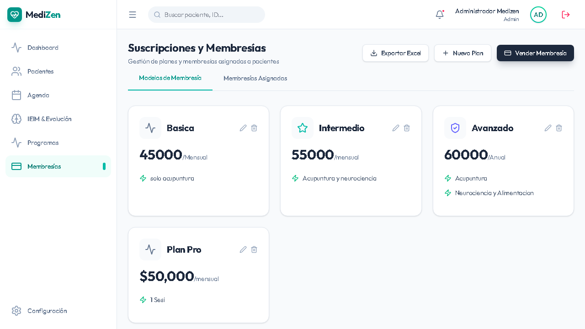
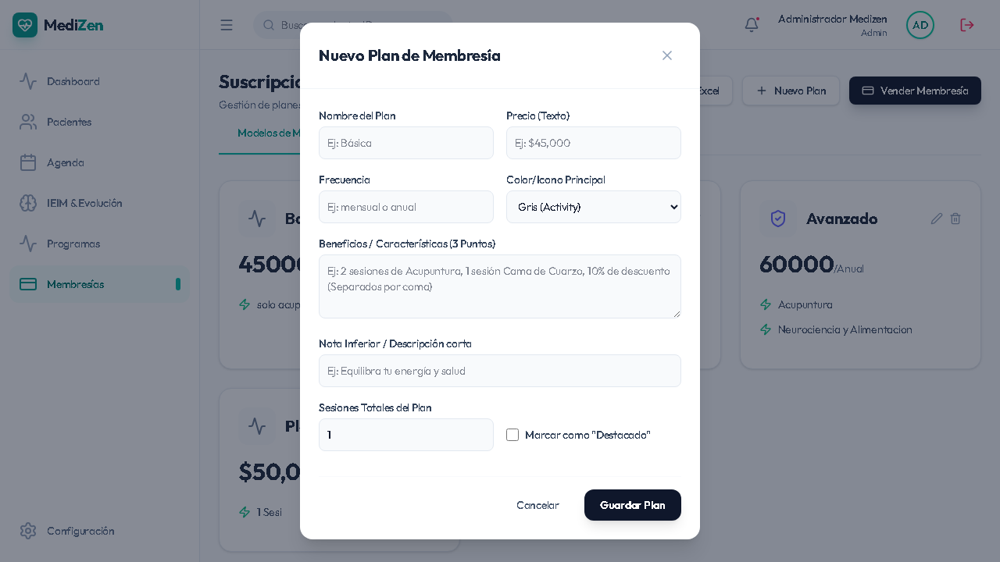

# Manual de Usuario: MediZen v2.1
**Plataforma de Salud y Membresías de Bienestar**

Este manual documenta el uso de las dos aplicaciones principales que conforman el ecosistema MediZen en su versión 2.1: El **Portal Administrativo Core** y el **Portal de Pacientes**.

---

## 1. Portal Administrativo (Core)
El Portal Core es la herramienta central para el personal de MediZen, permitiendo gestionar pacientes, membresías y controlar el flujo de trabajo de la clínica.

### 1.1 Iniciar Sesión (Login)
La pantalla de inicio de sesión provee acceso seguro al equipo administrativo.

**Nuevos Cambios:**
* **Autenticación Basada en Tokens**: El inicio de sesión ahora utiliza JWT de forma nativa para mayor seguridad en cada operación.

### 1.2 Panel de Control (Dashboard)
El centro de operaciones desde donde se visualizan métricas clave de la clínica.

**Nuevos Cambios:**
* **Métricas en Tiempo Real**: Se conecta a la base de datos Neon PostgreSQL de producción para extraer la cantidad real de pacientes y membresías vendidas, abandonando los datos "mockeados".
* **Diseño Premium**: Interfaz renovada con tarjetas de resumen mejoradas visualmente.

### 1.3 Gestión de Pacientes
Lista todos los pacientes inscritos en el sistema, provenientes del portal público o registrados manualmente.

**Nuevos Cambios:**
* **Exportación a Excel Avanzada**: Las tablas de pacientes se pueden descargar como archivos `.xlsx` perfectos, con las columnas formatedas (nombre, fecha de nacimiento, contacto).
* **Filtro de Búsqueda Mejorado**: Ahora se puede buscar a cualquier paciente por email, nombre o apellido.

### 1.4 Registro de Nuevo Paciente

**Nuevos Cambios:**
* **Validación Robusta**: Formularios conectados a `react-hook-form` con validación Zod en el frontend y Pydantic en el backend, evitando inserciones erróneas.

### 1.5 Perfil de Paciente y Membresías Asociadas
Permite analizar todos los detalles de un usuario en específico.

**Nuevos Cambios:**
* **Vista 360 del Paciente**: Integra la visualización de datos personales con el historial de membresías asociadas al paciente en tiempo real.

### 1.6 Gestión de Planes de Membresía
Administración de la oferta principal de la clínica.

**Nuevos Cambios:**
* **Inclusión de "Descripción" a los Planes**: Ahora los planes soportan descripciones detalladas personalizadas, cruciales para diferenciarlos de cara al paciente.

### 1.7 Creación de Nuevo Plan

**Nuevos Cambios:**
* **Configuración del Plan**: Selector de precio (CLP), periodicidad, color de tarjeta para el portal público, y la nueva descripción dinámica, enviando los datos directo a la BD en la nube.

---

## 2. Portal de Pacientes (Frontend Público)
La puerta de entrada para que nuevos pacientes descubran y se suscriban a los servicios de la clínica.

### 2.1 Vista Principal y Planes
Los pacientes visitantes pueden recorrer la oferta de valor de MediZen y los planes vigentes.

**Nuevos Cambios:**
* **Sincronización en Tiempo Real**: Las tarjetas de los planes que ves en la pantalla se alimentan directamente de los planes creados en el "Portal Administrativo (Core)". Si creas un plan allí, aparecerá aquí inmediatamente con su precio, color y la nueva descripción.
* **Formulario de Inscripción Optimizado**: Al hacer clic en "Inscribirme", el paciente llena un formulario moderno que automáticamente envía los datos al backend (ruta `/public/enroll`), creándolo en el sistema Core de manera automática y sin intervención de un operador humano.

<strong>Nota Técnica sobre la Dirección (Address):</strong> A nivel estructural (Base de Datos PostgreSQL/SQLite y Rutas Backend), el sistema ya se encuentra 100% equipado para recibir y almacenar el campo "Dirección" de los usuarios. Sin embargo, dichos campos se encuentran intencionalmente ocultos en ambas pantallas a la espera de confirmación visual.

